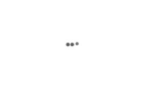

# react-native-typing-effect
> animation library for chat typing effect

Look example


#### How to install

```
npm install git+https://github.com/userbq201/react-native-typing-effect.git
```
or 
```
yarn add https://github.com/userbq201/react-native-typing-effect --save
```

#### How to use

```jsx
const isShow = true

const Screen = () => (
  <View style={{ flex: 1 }}>
    <TypingIndicator
      isShow={isShow}
      containerStyle={{ /* custom container style */ }}
      textStyle={{ /* custom text style */ }}
    />
  </View>
)
```

#### Props types

```containerStyle - custom style for container```

```textStyle - custom style for text```

```pointCount - point count (3 default)```

```duration - animation duration (150ms default)```

```isShow - controll visible (true default)```

```scaleTo - point scale max (4 default)```

```opacityTo - point opacity max (0.8 default)```
